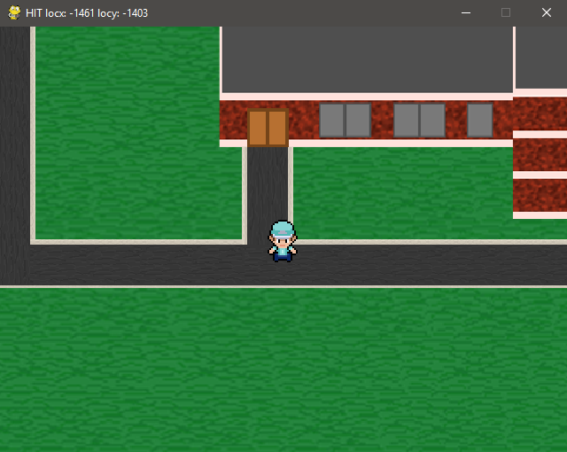
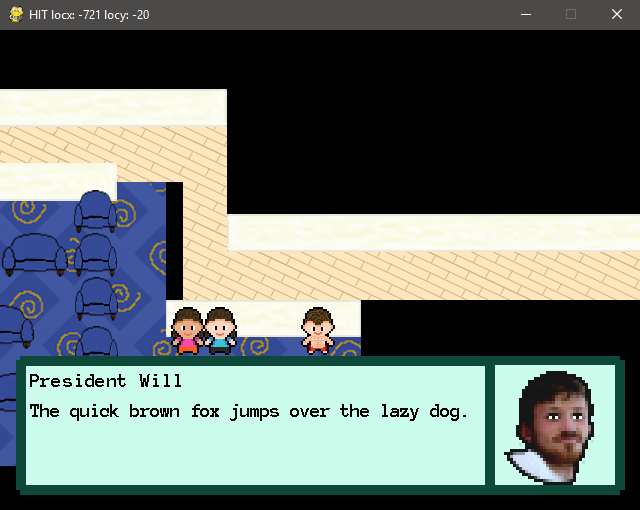

# Hinman-mon
## CS 110 Final Project
### Spring, 2018

https://github.com/binghamtonuniversity-cs110/final-project-spr18-dream-team-meme-team

https://docs.google.com/presentation/d/1WR46w5xDMWn6waTDRbIO-Vndbci4F-cpaTgP9X-acBg/edit?usp=sharing

### Dream Team, Meme Team:
#### William Mosier, Christopher Woloshyn, Michael Yip

***

## Project Description
Hinmanmon is a game concept heavily inspired by both the Pokemon franchise and the Hinman College Residential Community. The game features the player as a trainer that cares for, and battles with Hinmanmon (although these features are still in early development). It is set in the Hinman community and revolves heavily around exploring and interacting with the many residents of the various buildings. All art environments were made from scratch and are based on real people and locations from Hinman. This includes Al Vos, the collegiate professor of Hinman, and every building executive board member, including our backend specialist William Mosier (President of Hughes Hall). Currently, the gameplay involves exploring the open world and interacting with all the various residents of the community. The battling mechanics are still in early development, but a random encounter feature has been implemented to showcase the progress on this set of features. Currently, there is no way to lose, but the player can exit the game at will.

***    

## User Interface Design

### 1. Main Menu/Start Screen
This screen is the first thing a user sees. An opening animation and music plays before prompting the user to “press any key to continue.” After an input is pressed or the animation concludes, the game will begin with the opening dialogue.

### 2. Success Center Location
This screen is the first location the player appears in after the opening animations and cutscenes finish. From here, the player can have their first interactions with NPCs, specifically Al Vos, the collegiate professor of Hinman. They are free to explore the room and exit into the Hinman College exterior.

### 3. Hinman College Location
This screen is where the player can explore Hinman College. While there are no NPCs to interact with outside, if the player wanders around the Hinman quad, there is a chance they may randomly encounter a Hinmanmon. This is a very early feature, but is included to showcase our progress on these features.

### 4. Building Location (i.e. Hughes, Cleveland, Lehman, Roosevelt, Smith)
This screen represents the interior of the various residential halls in Hinman College. There are NPCs in all of the main lounges representing the members of those building’s executive boards. They can all be interacted with by going near them and pressing the “e” key. They all have their own unique dialogue that appears when the two aforementioned conditions are met. 

***

## Program Design

### Non-Standard Libraries and Modules Used

* __Pygame__ (https://www.pygame.org/) - A module set incorporating many common game development functions into python, developed by Pete Shinners and Pygame Community. Includes crucial graphical elements as well as a musical playback functionality.

### Class and File Relationships (Flowchart)

### List of Classes

* __Baldman__ - A class that defines a placeholder Hinmanmon - Inherits from the Hinmanmon class when instantiated, and serves as a temporary Hinmanmon for testing battle and encounter mechanics. For example, when entering an encounter on the Hinman quad, Baldman will be the Hinmanmon that always appears.

* __Controller__ - A class that defines the “rules” and logic of the interlocking relationships between the other classes and UI. Handles user input and updates all models according to that input. Serves as the communication between the user and the other models.

* __GUI__ - A class that uses pygame to redraw the updated models for the user. This class handles all of the visuals through the pygame module.

* __Hinman__ - A class that defines the environment the player interacts with. The location class, Player class, Hinmanmon class, and trainer class all operate within the Hinman class. This model serves as a communicator between these other models, and its information is what the GUI redraws from. This structure is necessary for many of the more complex mechanics we have implemented such as movement. Movement can be one of two methods; either the player moves about the screen, or the location moves about the player, depending on the size of the environment and where the player is in that environment. The Hinman class takes the information from these several classes, and organizes them for the GUI class.

* __Hinmanmon__ - A class that represents all Hinmanmon in a general sense. All specific Hinmanmon will inherit from this class. It handles the general mechanics of Hinmanmon such as health, moves, and other stats that are shared between all Hinmanmon.

* __Location__ - A class that defines a location the player can be. There are currently seven different locations in the game world, each has different information that defines it, and location is handled as a subset of the Hinman class.

* __Menu__ - A class that defines the opening cutscene animations and menu. It functions as a game within the main game that runs in its own loop within the main loop. It is designed this way so in the future, if save/load game mechanics are added, it will be easy to integrate with the opening cutscene.

* __Player__ - A class that defines the player’s information. Similar to the location class, the player class operates as a subset of the Hinman class.

* __Trainer__ - A class that defines all NPCs. As of now, All trainers have no Hinmanmon. In the future, when battling is implemented, trainers with Hinmanmon will initiate dialogue before battle whereas trainers without Hinmanmon only initiate dialogue on user input, and will not initiate battle.

***

## Tasks and Responsibilities

### Software Lead - William Mosier

Worked as integration specialist by helping organize the code for the main game into the proper MVC format, which allowed all portions of the code to be run from a single file. He worked very closely with the back end to develop the high-score database functionality, as well as establish the win- and fail-states for the main game. He also lead the implementation of the ‘sprite’ and ‘group’ classes of pygame into the back end code.

### Front End Specialist - Christopher Woloshyn

Front-end lead conducted significant research on using pygame to create visual aspects such as buttons and on-screen text. She used this information to design and program a consistent UI to help the player navigate the title screen, the instructions page, and the “GAME OVER” screen. In addition to implementing the wide majority of the visual element for the UI, she also collaborated with the Software Lead to create a jukebox function that played music and to add sound effects to the menu navigation buttons.

### Back End Specialist - Michael Yip

The back end specialist helped with the “Model” portion of BLOCKBUSTERS by writing the major classes that would be used in the main game, as well as implementing major pygame functionality into each of them. He also made headway in major game mechanics such as the basic paddle movement and advanced functionality such as the screen-wrap function for the paddle as it approached the ends of the screen. He collaborated with the Front End Specialist in the implementation of the classes into our Controller file, as well as develop our high-score database.

***

## Testing

### 1. Menu Testing

First, we run main.py and see if the game launches to the menu. Everything should be moving at the appropriate screen and the music should be playing. Then we press any key to continue as we are prompted to accelerate through the animation and fade to black. At this point, the opening cutscene dialogue from Al Vos will display on the screen, which can be accelerated if the user presses any key. After this brief opening scene, the player will appear inside the Hinman Success Center in Al Vos’ office, and can begin roaming the open world.

### 2. Game Testing

After the player is transported to the success center, we test to make sure the user’s input corresponds with the proper player movement direction and set of sprite animations e.g. UP corresponds with upwards movement and the upwards sprites, down corresponds with down, etc. After these tests are complete, we test to make sure the interaction method by triggering Al Vos’ dialogue to display. Then, we exit the success center location to ensure location transfer is functioning properly. At this point, the player should be in a new location and music should have started playing. We continue to enter and exit buildings and testing each NPCs dialogue as we approach them. When we have completed this, the next step is to trigger a random encounter on the Hinman Quad. Since it’s random, we walk around for a bit until it triggers. This is mainly to demonstrate the future implementation of these features.

***

## Acceptence Test Procedure

| Step                  | Procedure     | Expected Results  | Actual Results |
| ----------------------|:-------------:| -----------------:| -------------- |
|  1  | Run main.py  | 1) Player moves to the down when pressed once. 2) Player continues to move to the down when button is held and the sprite animation plays giving the illusion of walking. |  |
|  2  | User Presses Any Key When Prompted | | |
|  3  | Press D Key; hold D Key | 
|  4  | Press A Key; hold A Key |
|  5  | Press S Key; hold S Key |
|  6  | Press W Key; hold W Key |
|  7  | Check room collision and interior object collision |
|  8  | Press the E key when near Al Vos |
|  9  | Exit Success Center |
|  10 | General Playtesting |
|  11 | Random Encounter |
|  12 | Click red “X” button in top right corner of window |
