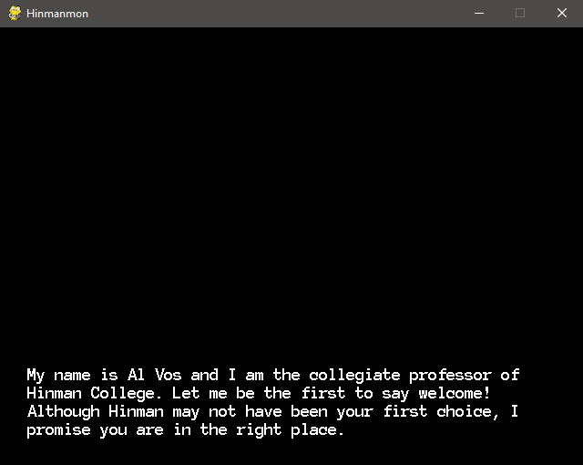
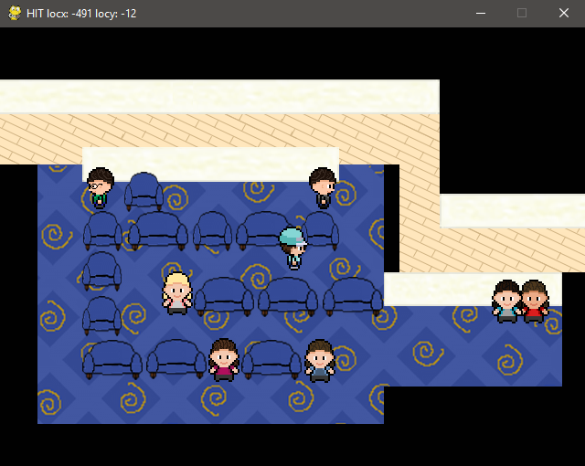

# Hinman-mon
## CS 110 Final Project
### Spring, 2018

https://github.com/binghamtonuniversity-cs110/final-project-spr18-dream-team-meme-team

https://docs.google.com/presentation/d/1WR46w5xDMWn6waTDRbIO-Vndbci4F-cpaTgP9X-acBg/edit?usp=sharing

### Dream Team, Meme Team:
#### William Mosier, Christopher Woloshyn, Michael Yip

***

## Project Description
Hinmanmon is a game concept heavily inspired by both the Pokemon franchise and the Hinman College Residential Community. The game features the player as a trainer that cares for, and battles with Hinmanmon (although these features are still in early development). It is set in the Hinman community and revolves heavily around exploring and interacting with the many residents of the various buildings. All art environments were made from scratch and are based on real people and locations from Hinman. This includes Al Vos, the collegiate professor of Hinman, and every building executive board member, including our backend specialist William Mosier (President of Hughes Hall). Currently, the gameplay involves exploring the open world and interacting with all the various residents of the community. The battling mechanics are still in early development, but a random encounter feature has been implemented to showcase the progress on this set of features. Currently, there is no way to lose, but the player can exit the game at will.

***    

## User Interface Design
### 1. Main Menu/Start Screen
    This screen is the first thing a user sees. An opening animation and music plays before prompting the user to “press any key to continue.” After an input is pressed or the animation concludes, the game will begin with the opening dialogue.
    
    
### 2. Success Center Location
    This screen is the first location the player appears in after the opening animations and cutscenes finish. From here, the player can have their first interactions with NPCs, specifically Al Vos, the collegiate professor of Hinman. They are free to explore the room and exit into the Hinman College exterior.
    
### 3. Hinman College Location
    This screen is where the player can explore Hinman College. While there are no NPCs to interact with outside, if the player wanders around the Hinman quad, there is a chance they may randomly encounter a Hinmanmon. This is a very early feature, but is included to showcase our progress on these features.
    
### 4. Building Location (i.e. Hughes, Cleveland, Lehman, Roosevelt, Smith)
    This screen represents the interior of the various residential halls in Hinman College. There are NPCs in all of the main lounges representing the members of those building’s executive boards. They can all be interacted with by going near them and pressing the “e” key. They all have their own unique dialogue that appears when the two aforementioned conditions are met. 
    
    
***        

## Program Design
* You should have a list of any additional libraries or modules used (pygame, request) beyond non-standard python.
    * For each additional module you should include
        * url for the module documentation
        * a short description of the module
* Decide upon a class interface for the classes in your project.
    * A simple drawing that shows the class relationships in your code (see the sample Proposal document for an example).
    * This does not need to be overly detailed, but should show how your code fits into the Model/View/Controller paradigm.
* You should have a list of each of your classes with a description.

***

## Tasks and Responsibilities
* You must outline the team member roles and who was responsible for each class/method, both individual and collaborative.
    * Example:
### Software Lead - William Mosier

Worked as integration specialist by helping organize the code for the main game into the proper MVC format, which allowed all portions of the code to be run from a single file. He worked very closely with the back end to develop the high-score database functionality, as well as establish the win- and fail-states for the main game. He also lead the implementation of the ‘sprite’ and ‘group’ classes of pygame into the back end code.

### Front End Specialist - Christopher Woloshyn

Front-end lead conducted significant research on using pygame to create visual aspects such as buttons and on-screen text. She used this information to design and program a consistent UI to help the player navigate the title screen, the instructions page, and the “GAME OVER” screen. In addition to implementing the wide majority of the visual element for the UI, she also collaborated with the Software Lead to create a jukebox function that played music and to add sound effects to the menu navigation buttons.

### Back End Specialist - Michael Yip

The back end specialist helped with the “Model” portion of BLOCKBUSTERS by writing the major classes that would be used in the main game, as well as implementing major pygame functionality into each of them. He also made headway in major game mechanics such as the basic paddle movement and advanced functionality such as the screen-wrap function for the paddle as it approached the ends of the screen. He collaborated with the Front End Specialist in the implementation of the classes into our Controller file, as well as develop our high-score database.

## Testing
* Describe your testing strategy for your project.
    * Example

### Menu Testing

First, we run Controller()  and ensure the main menu opens normally, the musical score begins playing and that hovering the mouse over each button changes the color to the “highlighted” shade. Next, we click the Instructions button to ensure the INSTRUCTIONS menu opens, and the buttons are highlighted when hovered over as well. We also check to see if the music playback continues and that the sound effect is played when the button is pressed.

We then press the MAIN MENU button and return, checking that the same functionality with button hover, music and sound effects as before are present. Afterwards, we test that both of the QUIT buttons on the Main Menu and Instructions Menu properly close the game.We then test the PLAY buttons on the Instructions and Main Menu pages to make sure that the Game screen opens properly both times. We then move

### Game Testing

When the Game screen boots up , we test if spacebar starts the game and launches the ball, so we test to see if this remains true. From there, in the middle of play, we will test the single-press and holding of both the left and right arrow buttons to make sure movement works in single presses and continues to move when a key is held. We then move all the way to the left and right of the screen to see if it causes the paddle to appear on the other side - our wrap-around function.

From here, we conduct normal playtesting to ensure that the collisions, the speed of the ball, and the dynamic bounding and angles are all working together meaningfully and without any obvious error, especially in regards to the ball reflecting off of the corners and edges of the paddle. We also check to make sure the music plays throughout and that the destruction of a brick does in fact increase the score.

We then try to reach a win state, to check if it resets the game with an increase in ball speed, without resetting the score. If successful, we then purposefully reach three consecutive fail-states, one to test each of the GAME OVER screens’ three buttons - Play Again, Main Menu, and Quit - with the same functionality as before. Finally, we check that the “X” button on the window does in fact close the window. This concludes the testing protocol.

* A copy of your ATP

| Step                  | Procedure     | Expected Results  | Actual Results |
| ----------------------|:-------------:| -----------------:| -------------- |
|  1  | Run Counter Program  | GUI window appears with count = 0  |          |
|  2  | click count button  | display changes to count = 1 |                 |
etc...
